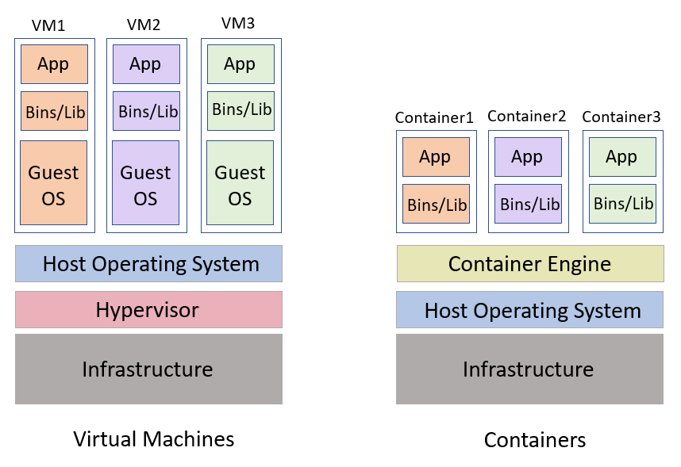

# Phase One: Foundations of Containerization & Microservices
---
## Session 1:
## 1.  Understanding Containers vs Virtual Machines (VMs)
### Definition
### 1.1. Virtual Machine (VM):
A VM is a software-based emulation of a physical computer that includes its own Operating System (OS), libraries, and applications. It runs on top of a hypervisor such as VMware, VirtualBox,or KVM.  

---
#### 1.1.1. Components of VM
| **Component** | **Description** |
|:--------------:|:----------------|
| **Host Machine** | The physical computer on which virtualization software (hypervisor) is installed. |
| **Guest Machine (VM)** | The virtual system that runs inside the host. It behaves like a separate computer. |
| **Hypervisor** | The software layer that creates, runs, and manages VMs. It allocates resources (CPU, RAM, storage, and network) from the host to each VM. |
| **Virtual Hardware** | Virtual CPU, memory, storage, and network interfaces assigned to each VM by the hypervisor. |

---
#### 1.1.2. Types of Hypervisors 
| **Type** | **Description** | **Examples** |
|:--:|:--|:--|
| **Type 1 (Bare-Metal)** | Installed directly on physical hardware. Commonly used in enterprise servers. | VMware ESXi<br>Microsoft Hyper-V<br>Xen |
| **Type 2 (Hosted)** | Runs as an application on top of an existing operating system. Ideal for personal or educational use. | Oracle VirtualBox<br>VMware Workstation<br>Parallels Desktop |

---
### 1.1.3. How to Include (Set Up) a VM

Here’s the general process to create or “include” a VM on your system:

**1. Step 1: Install a Hypervisor**

- Choose and install virtualization software:
- For personal use: VirtualBox (free, open source)
- For Windows Pro: Hyper-V
- For Mac: Parallels Desktop or UTM

**2. Step 2: Get an OS Image**

- Download an ISO file of the operating system you want to install inside the VM.

---
**- Examples:**

      Ubuntu → ubuntu.iso
      Windows → windows10.iso
**Step 3: Create a New VM**

- Open your hypervisor and
- Create a new virtual machine.
- Assign CPU, RAM, and disk space.
- Attach the ISO file to act as the virtual CD installer.

**Step 4: Install the OS**

- Start the VM → it will boot from the ISO → follow normal OS installation steps.
---

**Step 5: Install Guest Additions (Optional)**

- For better performance and features like:
- Full-screen resolution
- Clipboard sharing
- File drag-and-drop
-> install “Guest Additions” or “VM Tools” provided by the hypervisor.

#### 1.1.4. How a VM Communicates with Your Device (Networking)
VMs use virtual network adapters created by the hypervisor to communicate with your physical device and the external network

---
| **Mode** | **Description** | **Use Case** |
|:--:|:--|:--|
| **NAT (Network Address Translation)** | VM shares host’s IP address. The host acts as a router. | VM can access the Internet, but external devices cannot access the VM. |
| **Bridged Adapter** | VM is connected directly to the physical network as if it were another device. | Allows external network devices to access the VM. |
| **Host-Only Adapter** | Creates a private network between the host and the VM only. | Used for testing or internal communication. |
| **Internal Network** | Connects multiple VMs to each other (no host or Internet). | Useful for simulating isolated environments. |


---
### 1.2. Container
A container is a lightweight, isolated environment that packages an application and all its dependencies but shares the host OS kernel. Containers start faster, use fewer resources, and are portable across environments.

**1.2.1. Key Components of a Container**

 **Component** | **Description** |
|:--:|:--|
| **Container Engine** | Software that manages containers, e.g., Docker, Podman. |
| **Container Image** | A read-only template that contains the application code, libraries, and dependencies. |
| **Container** | A running instance of a container image. It is isolated but lightweight. |

---
 **Component** | **Description** |
|:--:|:--|
| **Host OS** | The physical or virtual machine running the container engine. |
| **Namespaces & Cgroups** | Kernel features that isolate containers’ processes, network, filesystem, and limit resource usage. |

#### 1.2.2. How to Create/Include a Container

 **Step 1: Install Container Engine**
- Docker is the most popular: docker command line + Docker Desktop
- Alternatives: Podman, containerd, LXC

---

**Step 2: Pull or Build an Image**
- Pull from public registry:

      docker pull ubuntu:latest

- Build from Dockerfile:

      docker build -t my-app:latest .

**Step 3: Run a Container**

    docker run -d -p 8080:80 my-app:latest

- -d → detached mode (runs in background)
- -p 8080:80 → maps host port 8080 to container port 80
---
**Step 4: Manage Containers**

- List running containers: docker ps
- Stop a container: docker stop <container-id>
- Remove a container: docker rm <container-id>

### 1.2.3. How Containers Communicate with Host & Network
Containers use virtual networking to communicate with:

1. Host machine
2. Other containers
3. External internet
 ---
| **Mode** | **Description** | **Use Case** |
|:--:|:--|:--|
| **Bridge** | Default. Containers get a private IP and communicate through NAT via the host. | Typical for web apps. |
| **Host** | Container shares the host’s network stack directly. | High-performance scenarios. |
| **None** | No networking, fully isolated. | Testing isolated apps. |
| **Overlay** | Connects containers across multiple hosts. | Used in Docker Swarm/Kubernetes. |

 ---
 - ### Difference Between VMs and Containers

| Feature | Virtual Machine | Container |
|-----------|-----------|-----------|
| OS | Includes full OS | 	Shares host OS |
| Startup Time | Minutes | Seconds |
| Size | Gigabytes | Megabytes |
| Isolation | Strong (hardware-level) | Moderate (process-level) |

**Example**:
**VM Example:** Running Ubuntu with Java application on VMware.
**Container Example:** Running a Node.js web app in Docker with only dependencies, not full OS.

---
#### Diagram


---
## 2. Benefits & Trade-Offs of Containers

### Definition
A **container** a lightweight, portable, and isolated environment that packages an application with everything it needs to run including code, runtime, and dependencies,but shares the host OS kernel instead of running its own operating system like a virtual machine (VM).
### Benefits of Containers
1. Containers run the same on any system that supports Docker/Kubernetes.
2. Share the host OS kernel → less RAM & CPU use.
4. Identical runtime environment everywhere.
5. Easily scale up or down using orchestration tools.
6. Great for CI/CD automation.
 ---

### Trade-Offs of Containers

1. Shared kernel may expose all containers to attacks.
2. Containers are temporary; local data is lost when stopped.
3. Multi-container networking can be tricky
4. Harder with many short-lived containers.
5. Docker and Kubernetes require new skills.

## 3. Container Registries
A **container registry** is a centralized repository used to store, manage, and distribute Docker images (container blueprints).

You can think of it like **GitHub** for **Docker images**.

---
### 3.1. Components of a Container Registry
| **Component** | **Description** |
|:--:|:--|
| **Registry Server** | Hosts container images and responds to client requests. Examples: Docker Hub, AWS ECR, GCP Artifact Registry. |
| **Repository** | A collection of related images, often grouped by application or project. |
| **Tag** | A label for an image version, e.g., `v1.0`, `latest`. Tags allow multiple versions of the same image to coexist. |
| **Client** | Docker CLI or other container tools used to push, pull, and manage images from the registry. |

---
### 3.2. Types of Container Registries
| **Type** | **Description** | **Example** |
|:--:|:--|:--|
| **Public Registry** | Accessible by anyone. Ideal for open-source projects. | Docker Hub, GitHub Container Registry |
| **Private Registry** | Restricted access. Used for internal or proprietary projects. | AWS Elastic Container Registry (ECR), Azure Container Registry, Harbor |
| **Cloud-Native Registry** | Hosted by cloud providers, tightly integrated with cloud services. | GCP Artifact Registry, AWS ECR, Azure ACR |
---
### 3.3 How to Use a Container Registry
**Step 1: Login**

- Authenticate with your registry:

      docker login


 - For private registries, credentials are required.

**Step 2: Tag the Image**

- Give your local image a reference to the registry:

      docker tag my-app:latest myregistry.com/my-app:v1
      
---

**Step 3: Push the Image**

- Upload your image to the registry:

      docker push myregistry.com/my-app:v1

**Step 4: Pull the Image**

- Download the image on another system:

      docker pull myregistry.com/my-app:v1

---
## 4. Authentication into Private Container Registries

**Definition:**
Private container registries require **authentication** to ensure that only authorized users or systems can push or pull images. This protects proprietary code and prevents unauthorized access to sensitive application images.

**Purpose:**
Authentication helps:
1. Secure the registry from unauthorized users

2. Maintain accountability for who uploads or downloads images

3. Ensure compliance with enterprise security policies

---
### 4.1. Common Authentication Methods:

1. **Username and Password / Tokens:**
Users authenticate with credentials or personal access tokens. These credentials are verified by the registry before allowing access.
Example with Docker CLI:

       docker login myregistry.com -u username -p mytoken

2. **Cloud-based Authentication:**
Cloud registries like AWS ECR, GCP GCR, and Azure ACR integrate with their respective cloud identity systems (IAM, service accounts, etc.) to provide secure access without manual login.
Example AWS ECR login:

       aws ecr get-login-password --region us-east-1 | docker login --username AWS --password-stdin <account-id>.dkr.ecr.amazonaws.com

---- 
3. **Kubernetes Secrets:**
In Kubernetes environments, credentials for private registries are stored as Secrets, which the cluster uses automatically when pulling images for pods.
            
    ```yaml
    apiVersion: v1
    kind: Secret
    metadata:
    name: regcred
    type: kubernetes.io/dockerconfigjson
    data:
    .dockerconfigjson: <base64-encoded-auth>          

4. **Single Sign-On (SSO) and Role-Based Access Control (RBAC):**
Enterprises often integrate registries with corporate identity systems (like Active Directory or SSO) and define specific roles and permissions for developers, DevOps teams, and automation tools.

---

### Key Considerations:
1. Use access tokens or IAM roles instead of plain passwords for better security.

2. Rotate credentials regularly to minimize risk.

3. Implement least-privilege access, giving users only the permissions they need.

4. Monitor access logs for suspicious activity.

5. Enable encryption in transit (HTTPS) for all registry communications.


